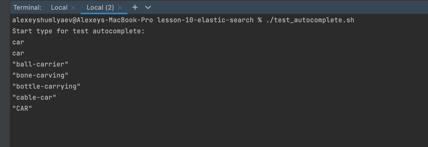
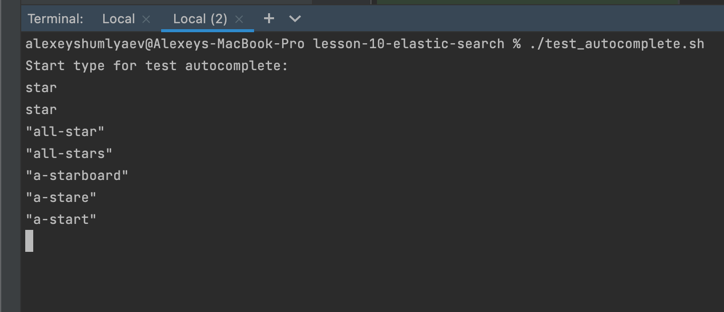
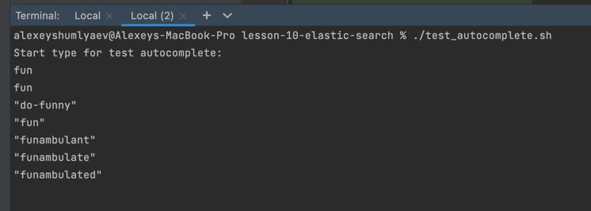

## Description

Example of using simple elastic search custom autocomplete.


## Commands

Run docker with elasticsearch
```bash
$ docker-compose up --build
```

Generate data for elastic search
```bash
$ node generate-elastic-search-data.js
```

Insert data to elasticsearch

```bash
$ curl --request PUT localhost:9200/_bulk -H "Content-Type: application/json" --data-binary @elastic_search_data.txt
```

Create new index structure for autocomplete

```bash
$ curl --request PUT 'http://localhost:9200/en_words_autocomplete' \
--header 'Content-Type: application/json' \
-d '{
   "mappings": {
       "properties": {
           "en_word": {
               "type": "search_as_you_type"
           }
       }
   }
}'
```

Add data into new autocomplete index
```bash
$ curl --silent --request POST 'http://localhost:9200/_reindex?pretty' --header 'Content-Type: application/json' --data-raw '{
 "source": {
   "index": "english_words"
 },
 "dest": {
   "index": "en_words_autocomplete"
 }
}' | grep "total\|created\|failures"
```


Check how search by index works
```bash
$ curl -s --request GET 'http://localhost:9200/en_words_autocomplete/_search?pretty' --header 'Content-Type: application/json' --data-raw '{
   "size": 5,
   "query": {
       "multi_match": {
           "query": "car",
           "type": "bool_prefix",
           "fields": [
               "en_word",
               "en_word._2gram",
               "en_word._3gram"
           ]
       }
   }
}'
```

## Optional

Install jq

```bash
$ brew install jq
```

Run bash script with display autocomplete and then enter some word

```bash
$ ./test_autocomplete.sh
```

## Results

<p></p>
<p></p>
<p></p>