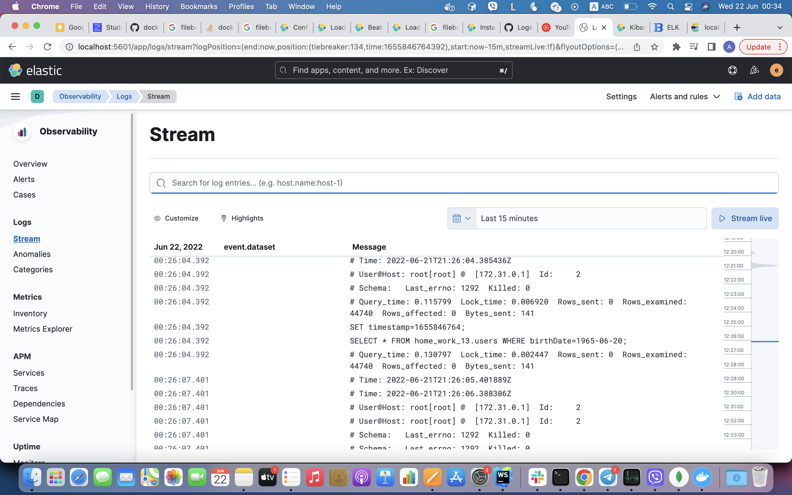
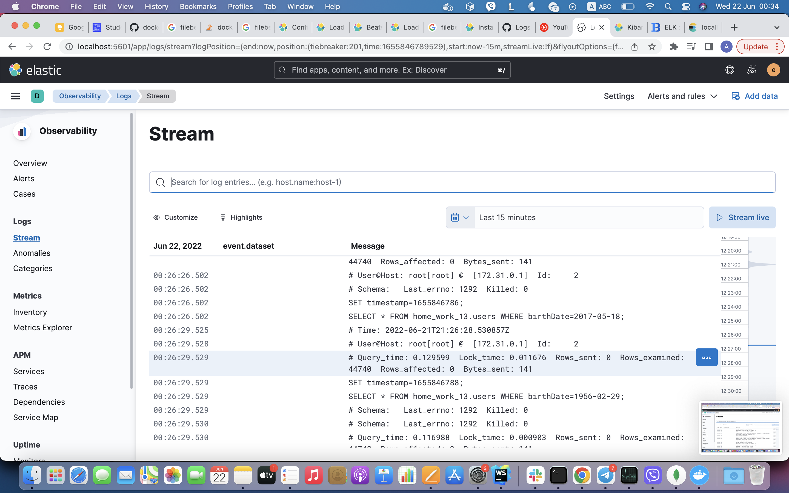
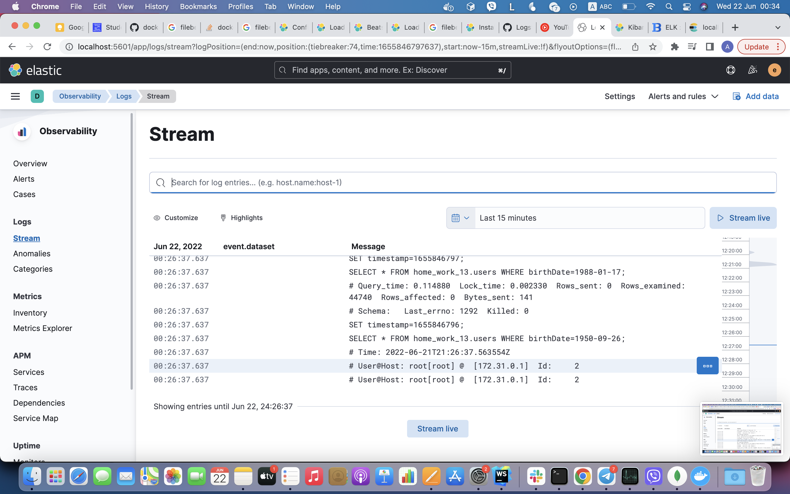
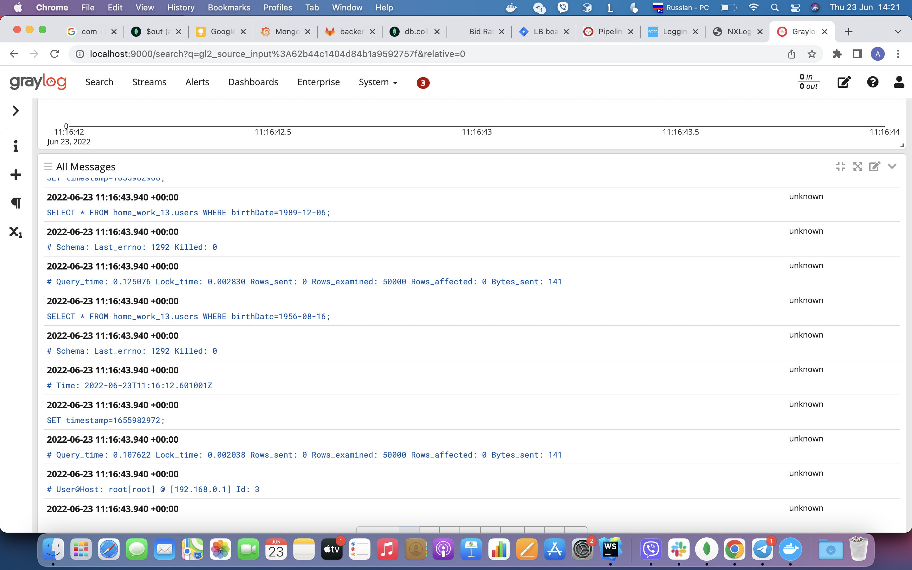
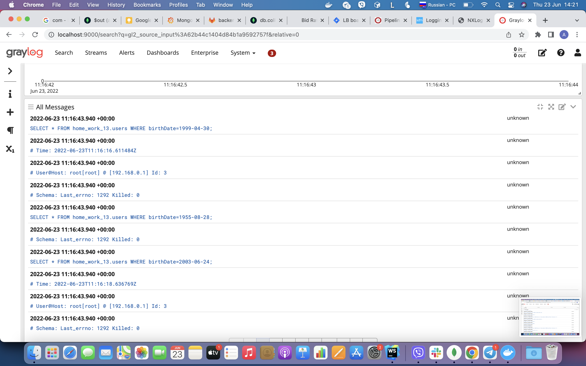
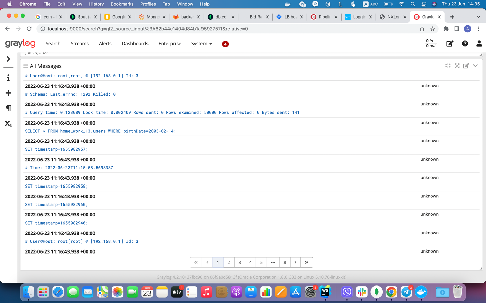

## Description

App for testing elk and graylog setups.

## install

```bash
cd elk-setup/app or graylog-setup/app

$ npm install
```

## add data

```bash
cd elk-setup/app or graylog-setup/app

$ node initData.js
```

## run test

```bash
cd elk-setup or graylog-setup
clear && docker-compose up --build
cd elk-setup/app or graylog-setup/app

# run search requests for set data to mysql slow query log
$ node searchData.js
```

## Results

## ELK SETUP

<p align="center" xmlns="http://www.w3.org/1999/html">
  
</p>

<p align="center" xmlns="http://www.w3.org/1999/html">
  
</p>

<p align="center" xmlns="http://www.w3.org/1999/html">
  
</p>

## GRAYLOG SETUP

<p align="center" xmlns="http://www.w3.org/1999/html">
  
</p>

<p align="center" xmlns="http://www.w3.org/1999/html">
  
</p>

<p align="center" xmlns="http://www.w3.org/1999/html">
  
</p>