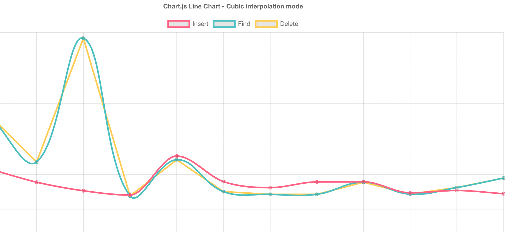

### Part 1 - BST-Tree

### Run bst-tree  tests
```bash
node --max-old-space-size=4096 bst-tree/measurements/insert.js
node --max-old-space-size=4096 bst-tree/measurements/find.js
node --max-old-space-size=4096 bst-tree/measurements/delete.js
```

Each command will create json file with array of values describe execution time for each operation in test.
Next i used this resource for display data https://www.chartjs.org/docs/latest/samples/line/line.html
### Results

<p></p>

<p>The spike at the beginning of the test may be due to the fact that the jit compiler inside the node has not yet warmed up. </p>

### Part 2 - Counting sort

Test data are randomized first 12 characters of the alphabet.
```bash
 node counting-sort/index.js 
```

Counting Sort doesn’t perform when we can have data with very different range like
```bash
 const arr = [1, 5, 4, 10, 10_000, 8, 3, 500_000, 2, 10_000_000];
```

In this case we have only 10 values for sorting, but we will have "count" array with length = 10_000_000.