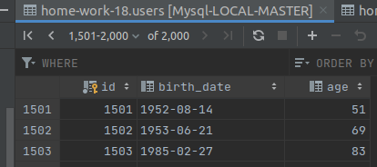

### Part 1 - Master - Slave Replication

### install
```bash
docker-compose up --build

# Slave_1 setup SQL
CHANGE MASTER TO MASTER_HOST={IF OF YOUR MASTER}, MASTER_USER='slave_2', MASTER_PASSWORD='password', MASTER_LOG_FILE = 'mysql-bin.000003', MASTER_LOG_POS = 157;
FLUSH PRIVILEGES;
START SLAVE;

# Slave_2 setup SQL
CHANGE MASTER TO MASTER_HOST={IF OF YOUR MASTER}, MASTER_USER='slave_2', MASTER_PASSWORD='password', MASTER_LOG_FILE = 'mysql-bin.000003', MASTER_LOG_POS = 157;
FLUSH PRIVILEGES;
START SLAVE;

cd app && npm install;
node create-users.js
```

### Results


<p></p>
<p></p>
<p></p>
<p></p>
<p></p>
<p></p>
<p></p>
<p></p>
<p></p>
<p></p>
<p></p>
