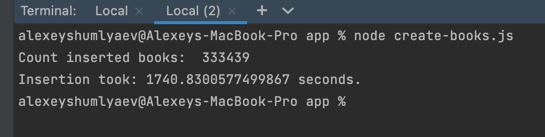
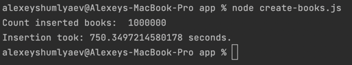

### Part 1 - Sharding

### install
```bash
cd postgrese-sharding

docker-compose up --build

cd app 

npm install

node create-users.js
```

### Results


<p></p>

Note: 333_439 count instead of 1_000_000 because script run count query on base server where stored books with category = 1, 
so we have ± 33% inserts  


## Part 2 - Single instance

### install
```bash
cd postgrese-sharding

docker-compose up --build

cd app 

npm install

node create-users.js
```

### Results


<p></p>