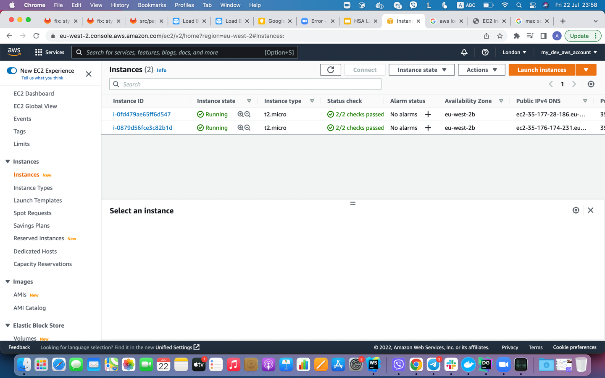
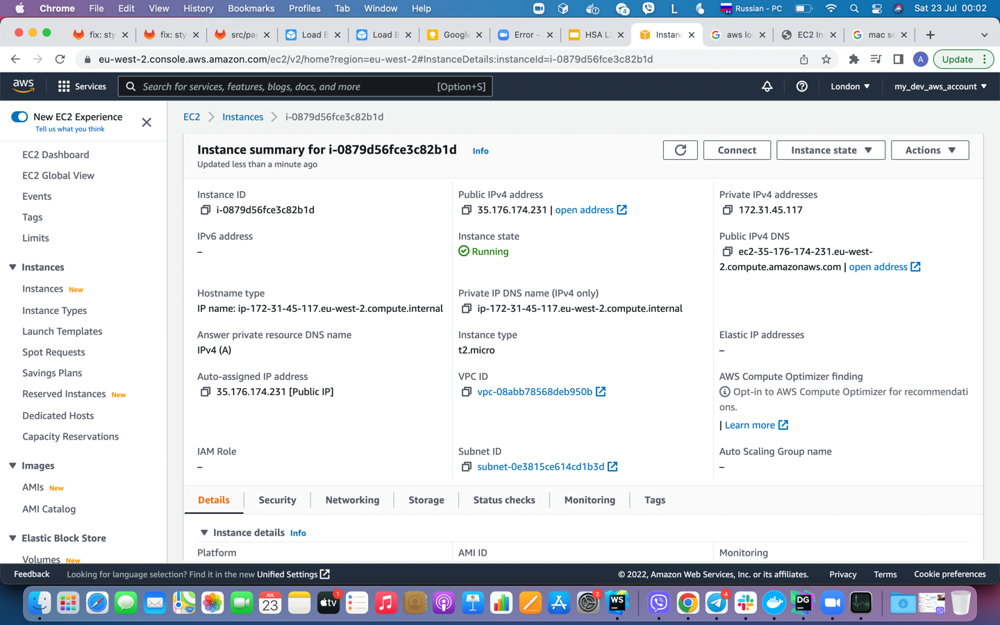
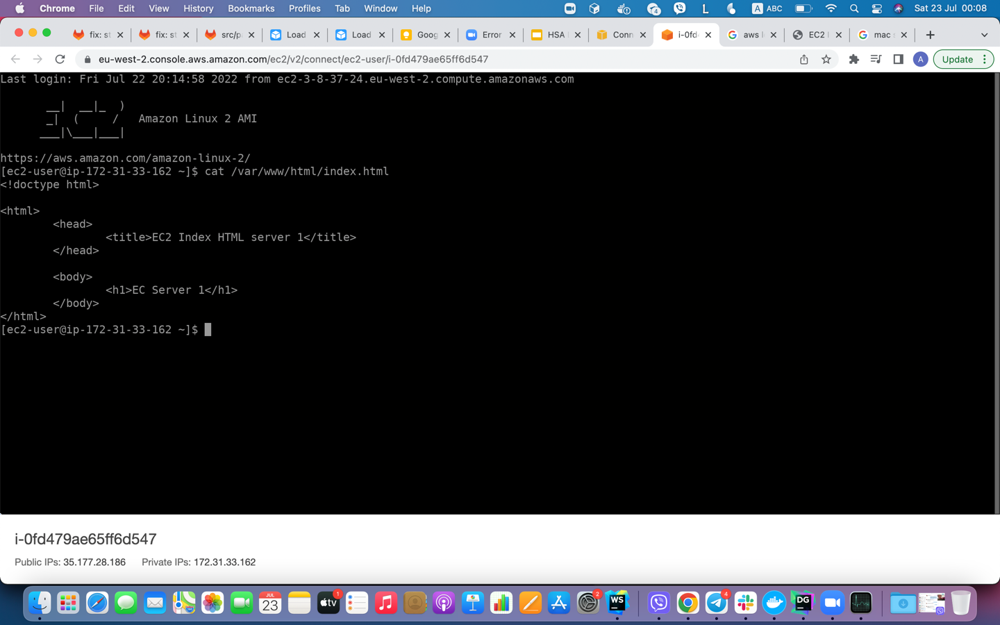
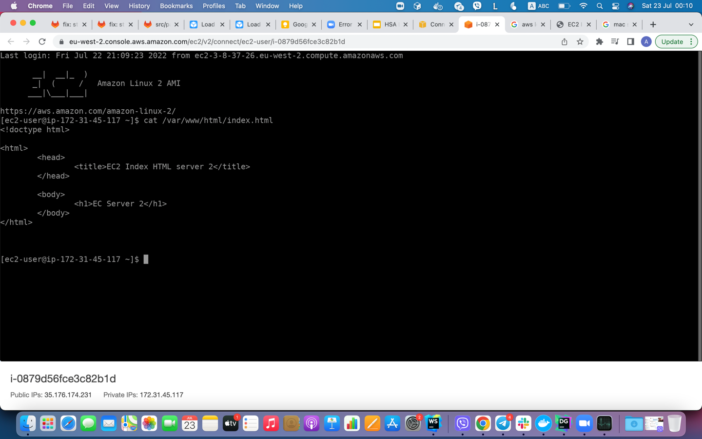
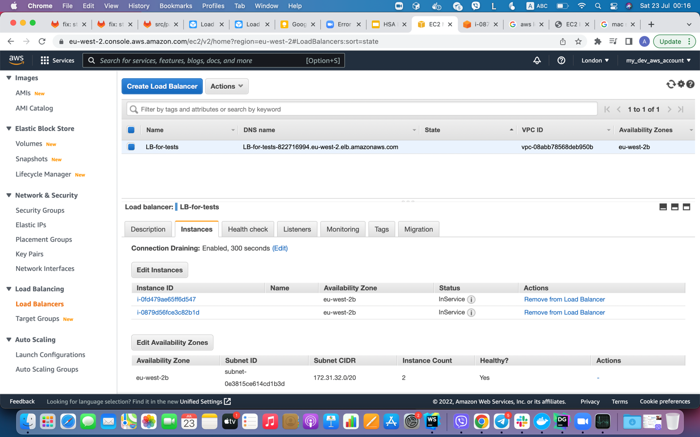
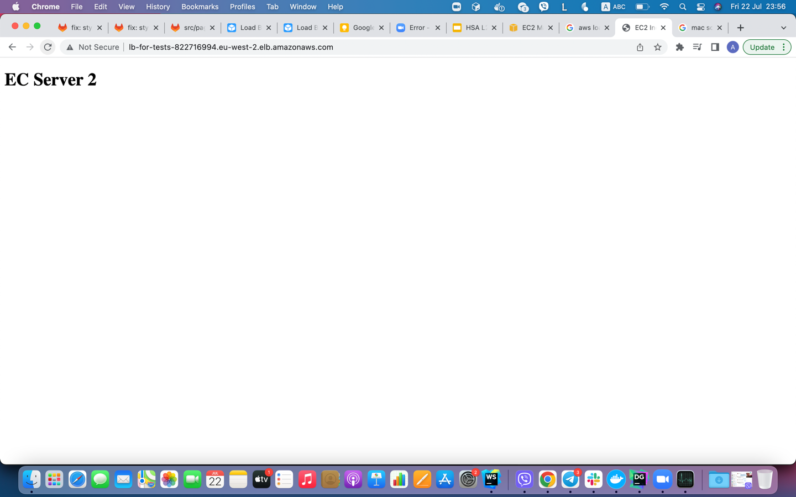

### Example setup ESC2 instances with load balancer

### ESC2 Instances

### Instance 1 settings

### Instance 2 settings

### Instance 1 html

### Instance 2 html

### Load balancer settings

### Load balancer instance 1 response

### Load balancer instance 2 response

