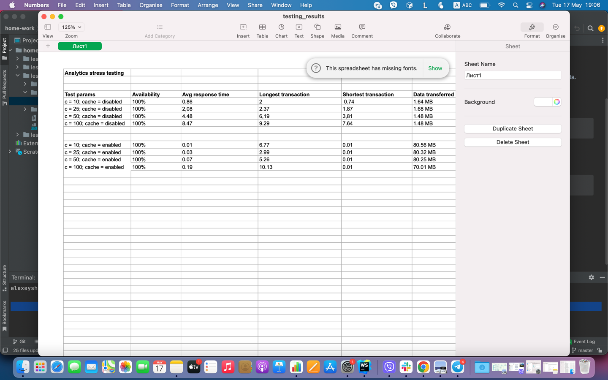

<p align="center" xmlns="http://www.w3.org/1999/html">
  <a href="https://nodejs.org/uk/" target="blank"></a>
</p>

## Description

Nodejs app for stress testing.

## Installation

```bash
$ npm install
```

## Notes

```bash
api url: http://localhost:3000/test
```

## Results

<p align="center" xmlns="http://www.w3.org/1999/html">
  
</p>