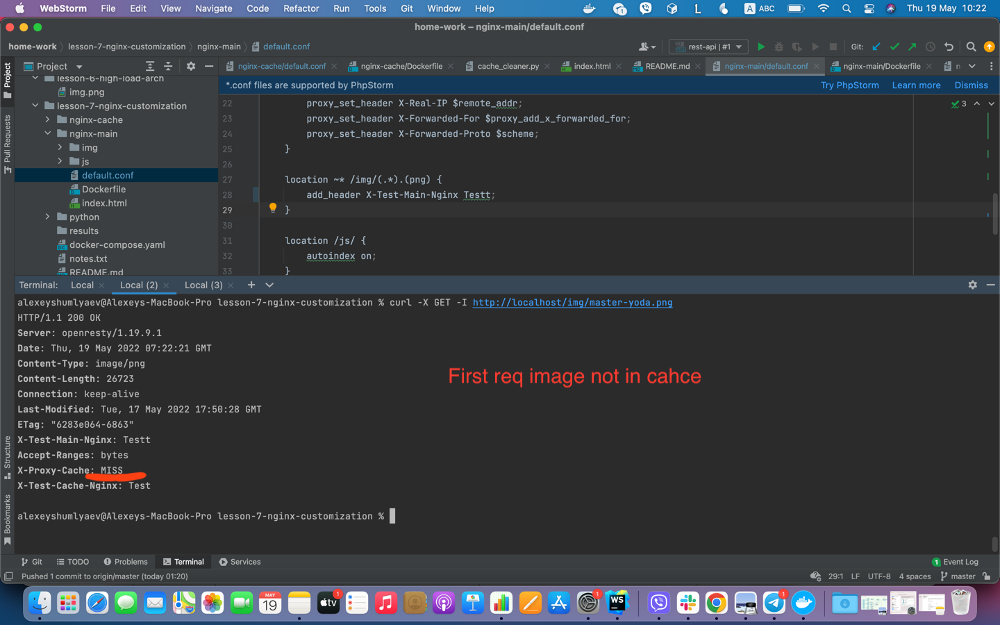
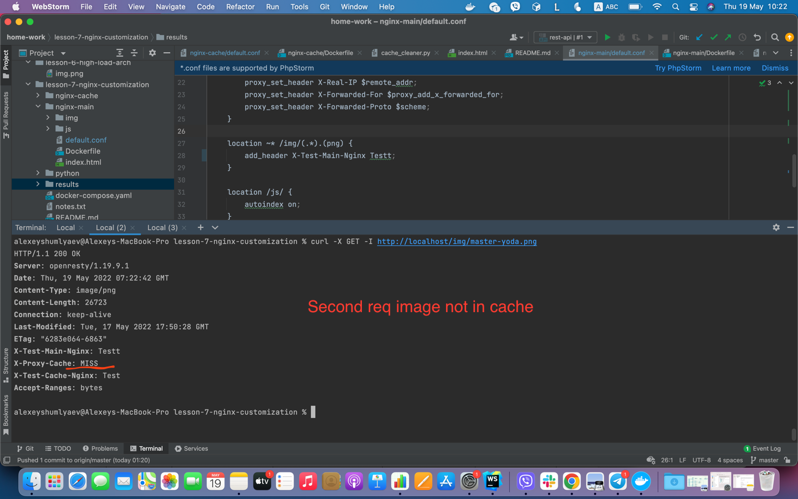
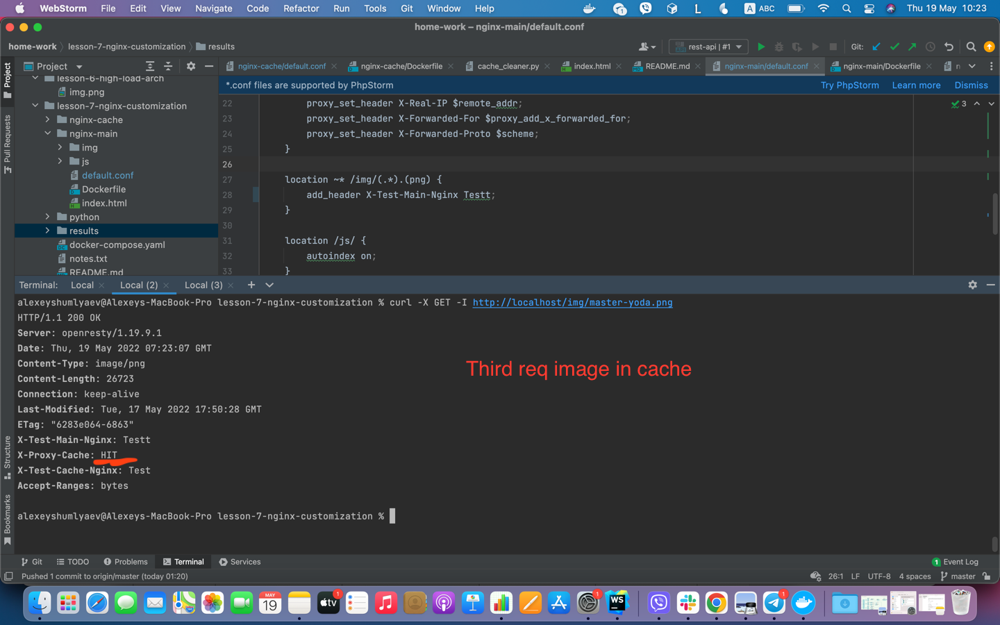
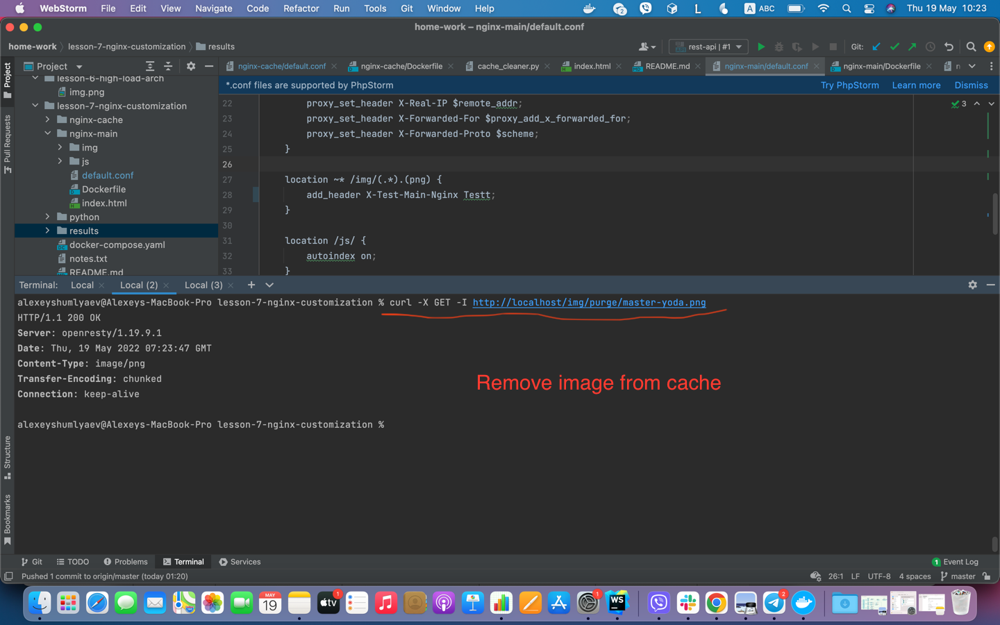
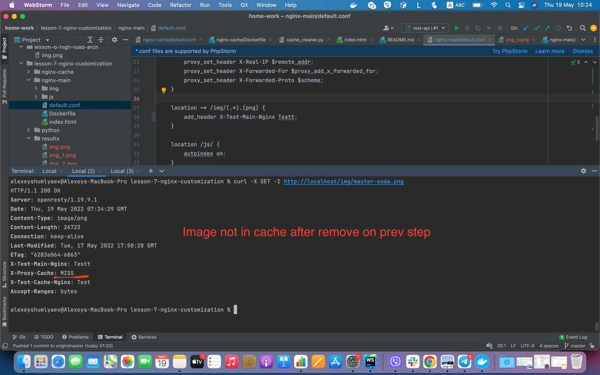

<p align="center" xmlns="http://www.w3.org/1999/html">
  <a href="https://nodejs.org/uk/" target="blank"></a>
</p>

## Run

```bash
$ docker-compose up --build
```

## Tests

```bash
fetch img 1: 
curl -X GET -I http://localhost/img/master-yoda.png

fetch img 2: 
curl -X GET -I http://localhost/img/darth-vader.png

```

## Results

<p align="center" xmlns="http://www.w3.org/1999/html">
  
</p>

<p align="center" xmlns="http://www.w3.org/1999/html">
  
</p>

<p align="center" xmlns="http://www.w3.org/1999/html">
  
</p>

<p align="center" xmlns="http://www.w3.org/1999/html">
  
</p>

<p align="center" xmlns="http://www.w3.org/1999/html">
  
</p>

